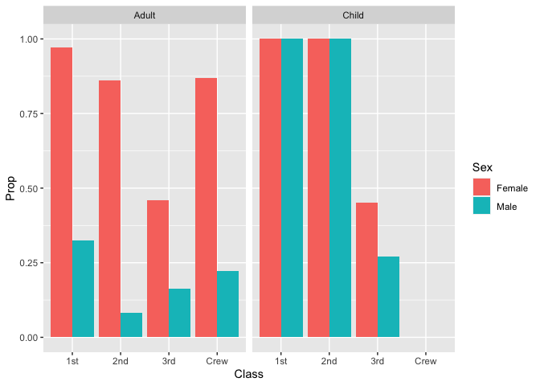

RMS Titanic
================
Elliott Donlon
15 July 2020

  - [Grading Rubric](#grading-rubric)
      - [Individual](#individual)
      - [Team](#team)
      - [Due Date](#due-date)
  - [First Look](#first-look)
  - [Deeper Look](#deeper-look)
  - [Notes](#notes)

*Purpose*: Most datasets have at least a few variables. Part of our task
in analyzing a dataset is to understand trends as they vary across these
different variables. Unless we’re careful and thorough, we can easily
miss these patterns. In this challenge you’ll analyze a dataset with a
small number of categorical variables and try to find differences among
the groups.

*Reading*: (Optional) [Wikipedia
article](https://en.wikipedia.org/wiki/RMS_Titanic) on the RMS Titanic.

<!-- include-rubric -->

# Grading Rubric

<!-- -------------------------------------------------- -->

Unlike exercises, **challenges will be graded**. The following rubrics
define how you will be graded, both on an individual and team basis.

## Individual

<!-- ------------------------- -->

| Category    | Unsatisfactory                                                                   | Satisfactory                                                               |
| ----------- | -------------------------------------------------------------------------------- | -------------------------------------------------------------------------- |
| Effort      | Some task **q**’s left unattempted                                               | All task **q**’s attempted                                                 |
| Observed    | Did not document observations                                                    | Documented observations based on analysis                                  |
| Supported   | Some observations not supported by analysis                                      | All observations supported by analysis (table, graph, etc.)                |
| Code Styled | Violations of the [style guide](https://style.tidyverse.org/) hinder readability | Code sufficiently close to the [style guide](https://style.tidyverse.org/) |

## Team

<!-- ------------------------- -->

| Category   | Unsatisfactory                                                                                   | Satisfactory                                       |
| ---------- | ------------------------------------------------------------------------------------------------ | -------------------------------------------------- |
| Documented | No team contributions to Wiki                                                                    | Team contributed to Wiki                           |
| Referenced | No team references in Wiki                                                                       | At least one reference in Wiki to member report(s) |
| Relevant   | References unrelated to assertion, or difficult to find related analysis based on reference text | Reference text clearly points to relevant analysis |

## Due Date

<!-- ------------------------- -->

All the deliverables stated in the rubrics above are due on the day of
the class discussion of that exercise. See the
[Syllabus](https://docs.google.com/document/d/1jJTh2DH8nVJd2eyMMoyNGroReo0BKcJrz1eONi3rPSc/edit?usp=sharing)
for more information.

``` r
library(tidyverse)
```

    ## ── Attaching packages ───────────────────────────────────────────────── tidyverse 1.3.0 ──

    ## ✓ ggplot2 3.3.2     ✓ purrr   0.3.4
    ## ✓ tibble  3.0.1     ✓ dplyr   1.0.0
    ## ✓ tidyr   1.1.0     ✓ stringr 1.4.0
    ## ✓ readr   1.3.1     ✓ forcats 0.5.0

    ## ── Conflicts ──────────────────────────────────────────────────── tidyverse_conflicts() ──
    ## x dplyr::filter() masks stats::filter()
    ## x dplyr::lag()    masks stats::lag()

``` r
df_titanic <- as_tibble(Titanic)
```

*Background*: The RMS Titanic sank on its maiden voyage in 1912; about
67% of its passengers died.

# First Look

<!-- -------------------------------------------------- -->

**q1** Perform a glimpse of `df_titanic`. What variables are in this
dataset?

``` r
## TASK: Perform a `glimpse` of df_titanic
glimpse(df_titanic)
```

    ## Rows: 32
    ## Columns: 5
    ## $ Class    <chr> "1st", "2nd", "3rd", "Crew", "1st", "2nd", "3rd", "Crew", "1…
    ## $ Sex      <chr> "Male", "Male", "Male", "Male", "Female", "Female", "Female"…
    ## $ Age      <chr> "Child", "Child", "Child", "Child", "Child", "Child", "Child…
    ## $ Survived <chr> "No", "No", "No", "No", "No", "No", "No", "No", "No", "No", …
    ## $ n        <dbl> 0, 0, 35, 0, 0, 0, 17, 0, 118, 154, 387, 670, 4, 13, 89, 3, …

**Observations**:

  - Class
  - Sex
  - Age
  - Survived
  - n

**q2** Skim the [Wikipedia
article](https://en.wikipedia.org/wiki/RMS_Titanic) on the RMS Titanic,
and look for a total count of passengers. Compare against the total
computed below. Are there any differences? Are those differences large
or small? What might account for those differences?

``` r
## NOTE: No need to edit! We'll cover how to
## do this calculation in a later exercise.
df_titanic %>% summarize(total = sum(n))
```

    ## # A tibble: 1 x 1
    ##   total
    ##   <dbl>
    ## 1  2201

**Observations**:

  - The wikipedia article states that 2224 passengers and crew were
    aboard. This difference is 23. This relatively small difference
    (\~1%) could be attributed to the fact that some passengers that
    bought tickets didn’t show for various reasons while others left
    part-way through the journey.

**q3** Create a plot showing the count of passengers who *did* survive,
along with aesthetics for `Class` and `Sex`. Document your observations
below.

*Note*: There are many ways to do this.

``` r
## TASK: Visualize counts against `Class` and `Sex`
df_titanic %>%
  filter(Survived == "Yes") %>%
  ggplot() +
  geom_col(mapping = aes(x = Class, y = n, fill = Sex))
```

<!-- -->

``` r
  #facet_wrap( ~ sex)
```

**Observations**:

  - We can see that there are more male crew members that survived the
    incident than females
  - More females survived in 1st and 2nd class
  - About equal proportions survived in 3rd class
  - There are less second-class people that survived of any class
  - How are these data skewed by the number of people in each class to
    begin with?

# Deeper Look

<!-- -------------------------------------------------- -->

Raw counts give us a sense of totals, but they are not as useful for
understanding differences between groups. This is because the
differences we see in counts could be due to either the relative size of
the group OR differences in outcomes for those groups. To make
comparisons between groups, we should also consider *proportions*.\[1\]

The following code computes proportions within each `Class, Sex, Age`
group.

``` r
## NOTE: No need to edit! We'll cover how to
## do this calculation in a later exercise.
df_prop <-
  df_titanic %>%
  group_by(Class, Sex, Age) %>%
  mutate(
    Total = sum(n),
    Prop = n / Total
  ) %>%
  ungroup()
df_prop
```

    ## # A tibble: 32 x 7
    ##    Class Sex    Age   Survived     n Total    Prop
    ##    <chr> <chr>  <chr> <chr>    <dbl> <dbl>   <dbl>
    ##  1 1st   Male   Child No           0     5   0    
    ##  2 2nd   Male   Child No           0    11   0    
    ##  3 3rd   Male   Child No          35    48   0.729
    ##  4 Crew  Male   Child No           0     0 NaN    
    ##  5 1st   Female Child No           0     1   0    
    ##  6 2nd   Female Child No           0    13   0    
    ##  7 3rd   Female Child No          17    31   0.548
    ##  8 Crew  Female Child No           0     0 NaN    
    ##  9 1st   Male   Adult No         118   175   0.674
    ## 10 2nd   Male   Adult No         154   168   0.917
    ## # … with 22 more rows

**q4** Replicate your visual from q3, but display `Prop` in place of
`n`. Document your observations, and note any new/different observations
you make in comparison with q3.

``` r
df_prop %>%
  filter(Survived == "Yes") %>%
  ggplot() +
  geom_col(mapping = aes(x = Class, y = Prop, fill = Sex))
```

    ## Warning: Removed 2 rows containing missing values (position_stack).

<!-- -->

``` r
  #facet_wrap( ~ sex)
```

**Observations**:

  - It seems that the prop variable is totaled by each combination of
    class, age and sex so when viewed like this, the prop value is kind
    of meaningless.
  - If we re-compute the totals we can get more accurate proportions at
    this depth of analysis (see figure q4-task\_b)
  - If we split the data like in the q5 plot, we get a better idea of
    what is going on proportionally.

<!-- end list -->

``` r
df_prop_class <-
  df_titanic %>%
  group_by(Class, Sex) %>%
  mutate(
    Total = sum(n),
    Prop = n / Total
  ) %>%
  ungroup()
df_prop_class
```

    ## # A tibble: 32 x 7
    ##    Class Sex    Age   Survived     n Total   Prop
    ##    <chr> <chr>  <chr> <chr>    <dbl> <dbl>  <dbl>
    ##  1 1st   Male   Child No           0   180 0     
    ##  2 2nd   Male   Child No           0   179 0     
    ##  3 3rd   Male   Child No          35   510 0.0686
    ##  4 Crew  Male   Child No           0   862 0     
    ##  5 1st   Female Child No           0   145 0     
    ##  6 2nd   Female Child No           0   106 0     
    ##  7 3rd   Female Child No          17   196 0.0867
    ##  8 Crew  Female Child No           0    23 0     
    ##  9 1st   Male   Adult No         118   180 0.656 
    ## 10 2nd   Male   Adult No         154   179 0.860 
    ## # … with 22 more rows

``` r
df_prop_class %>%
  filter(Survived == "Yes") %>%
  ggplot() +
  geom_col(mapping = aes(x = Class, y = Prop, fill = Sex), position = 'dodge')
```

<!-- -->

**Observations**:

  - Here, since we changed the way we calculate the proportions by
    grouping, we can clearly see what proportion of sexes in each class
    are survivors.
  - We can clearly see that females had much higher survival rate than
    their male counterparts in each class.
  - 3rd class was still lowest-survival at about 37% survival for
    females and about 13% for males.
  - Almost all females in 1st class survived and about 87% of female crw
    members survived while 75% of 2nd class females survived.

**q5** Create a plot showing the group-proportion of passengers who
*did* survive, along with aesthetics for `Class`, `Sex`, *and* `Age`.
Document your observations below.

*Hint*: Don’t forget that you can use `facet_grid` to help consider
additional variables\!

``` r
df_prop %>%
  filter(Survived == "Yes") %>%
  ggplot() +
  geom_col(mapping = aes(x = Class, y = Prop, fill = Sex), position = 'dodge') +
  facet_wrap( ~ Age)
```

    ## Warning: Removed 2 rows containing missing values (geom_col).

<!-- -->

**Observations**:

  - Children had a much higher survival rate than their adult
    counterparts in 1st and 2nd class.
  - Children in 3rd class were about equal in survival rate to their
    adult counterparts.
  - (Thank goodness there were no child crew members)
  - All children in 1st and 2nd class survived (yay)\!
  - More female children survived than male children where applicable
    (3rd class).
  - Hypothesis: “Women and children first” *could* be a mindset that
    hinders the survival of able-bodied men in this catastrophe. If we
    assume that is true, which men are most “chivalrous”?

<!-- end list -->

``` r
df_prop_chivalry <-
  df_titanic %>%
  filter(Age == "Adult") %>%
  group_by(Class, Sex) %>%
  mutate(
    Total = sum(n),
    Prop = n / Total
  ) %>%
  filter(Survived == "Yes") %>%
  select(-n, -Total)%>%
  pivot_wider(
   names_from = Sex,
   values_from = Prop
  ) %>%
  mutate(chivalry = Female / Male)
df_prop_chivalry
```

    ## # A tibble: 4 x 6
    ## # Groups:   Class [4]
    ##   Class Age   Survived   Male Female chivalry
    ##   <chr> <chr> <chr>     <dbl>  <dbl>    <dbl>
    ## 1 1st   Adult Yes      0.326   0.972     2.98
    ## 2 2nd   Adult Yes      0.0833  0.860    10.3 
    ## 3 3rd   Adult Yes      0.162   0.461     2.84
    ## 4 Crew  Adult Yes      0.223   0.870     3.90

**Summary Observations**

  - Overall, more females survived in each class
  - Children in 1st and 2nd class were most likely to survive of all
    groups
  - From the previous table we can see that for this definition of the
    “chivalry” metric, the men in 2nd class were 4 to 5x more
    “chivalrous” than the other classes.

# Notes

<!-- -------------------------------------------------- -->

\[1\] This is basically the same idea as [Dimensional
Analysis](https://en.wikipedia.org/wiki/Dimensional_analysis); computing
proportions is akin to non-dimensionalizing a quantity.
