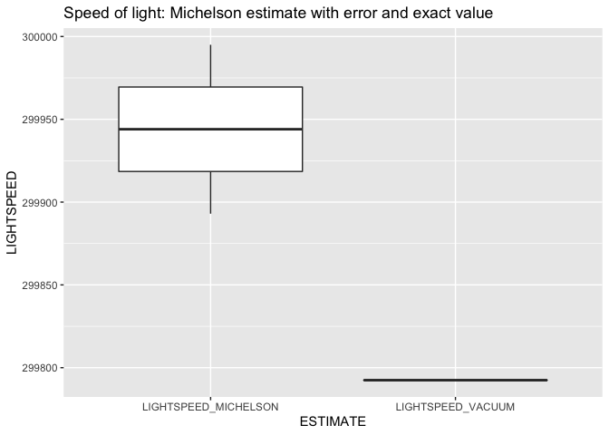
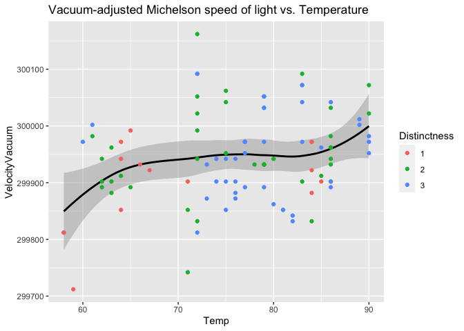
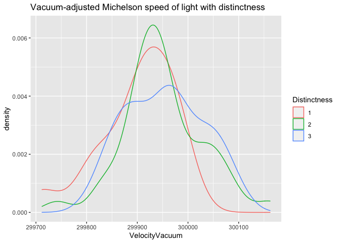

Michelson Speed-of-light Measurements
================
Elliott Donlon
18 July 2020

  - [Grading Rubric](#grading-rubric)
      - [Individual](#individual)
      - [Team](#team)
      - [Due Date](#due-date)
      - [Bibliography](#bibliography)

*Purpose*: When studying physical problems, there is an important
distinction between *error* and *uncertainty*. The primary purpose of
this challenge is to dip our toes into these factors by analyzing a real
dataset.

*Reading*: [Experimental Determination of the Velocity of
Light](https://play.google.com/books/reader?id=343nAAAAMAAJ&hl=en&pg=GBS.PA115)
(Optional)

<!-- include-rubric -->

# Grading Rubric

<!-- -------------------------------------------------- -->

Unlike exercises, **challenges will be graded**. The following rubrics
define how you will be graded, both on an individual and team basis.

## Individual

<!-- ------------------------- -->

| Category    | Unsatisfactory                                                                   | Satisfactory                                                               |
| ----------- | -------------------------------------------------------------------------------- | -------------------------------------------------------------------------- |
| Effort      | Some task **q**’s left unattempted                                               | All task **q**’s attempted                                                 |
| Observed    | Did not document observations                                                    | Documented observations based on analysis                                  |
| Supported   | Some observations not supported by analysis                                      | All observations supported by analysis (table, graph, etc.)                |
| Code Styled | Violations of the [style guide](https://style.tidyverse.org/) hinder readability | Code sufficiently close to the [style guide](https://style.tidyverse.org/) |

## Team

<!-- ------------------------- -->

| Category   | Unsatisfactory                                                                                   | Satisfactory                                       |
| ---------- | ------------------------------------------------------------------------------------------------ | -------------------------------------------------- |
| Documented | No team contributions to Wiki                                                                    | Team contributed to Wiki                           |
| Referenced | No team references in Wiki                                                                       | At least one reference in Wiki to member report(s) |
| Relevant   | References unrelated to assertion, or difficult to find related analysis based on reference text | Reference text clearly points to relevant analysis |

## Due Date

<!-- ------------------------- -->

All the deliverables stated in the rubrics above are due on the day of
the class discussion of that exercise. See the
[Syllabus](https://docs.google.com/document/d/1jJTh2DH8nVJd2eyMMoyNGroReo0BKcJrz1eONi3rPSc/edit?usp=sharing)
for more information.

``` r
# Libraries
library(tidyverse)
library(googlesheets4)

url <- "https://docs.google.com/spreadsheets/d/1av_SXn4j0-4Rk0mQFik3LLr-uf0YdA06i3ugE6n-Zdo/edit?usp=sharing"

# Parameters
LIGHTSPEED_VACUUM    <- 299792.458 # Exact speed of light in a vacuum (km / s)
LIGHTSPEED_MICHELSON <- 299944.00  # Michelson's speed estimate (km / s)
LIGHTSPEED_PM        <- 51         # Michelson error estimate (km / s)
```

*Background*: In 1879 Albert Michelson led an experimental campaign to
measure the speed of light. His approach was a development upon the
method of Foucault, and resulted in a new estimate of
\(v_0 = 299944 \pm 51\) kilometers per second (in a vacuum). This is
very close to the modern *exact* value of `r LIGHTSPEED_VACUUM`. In this
challenge, you will analyze Michelson’s original data, and explore some
of the factors associated with his experiment.

I’ve already copied Michelson’s data from his 1880 publication; the code
chunk below will load these data from a public googlesheet.

*Aside*: The speed of light is *exact* (there is **zero error** in the
value `LIGHTSPEED_VACUUM`) because the meter is actually
[*defined*](https://en.wikipedia.org/wiki/Metre#Speed_of_light_definition)
in terms of the speed of light\!

``` r
## Note: No need to edit this chunk!
gs4_deauth()
ss <- gs4_get(url)
df_michelson <-
  read_sheet(ss) %>%
  select(Date, Distinctness, Temp, Velocity) %>%
  mutate(Distinctness = as_factor(Distinctness))
```

    ## Reading from "michelson1879"

    ## Range "Sheet1"

``` r
df_michelson %>% glimpse
```

    ## Rows: 100
    ## Columns: 4
    ## $ Date         <dttm> 1879-06-05, 1879-06-07, 1879-06-07, 1879-06-07, 1879-06…
    ## $ Distinctness <fct> 3, 2, 2, 2, 2, 2, 3, 3, 3, 3, 2, 2, 2, 2, 2, 1, 3, 3, 2,…
    ## $ Temp         <dbl> 76, 72, 72, 72, 72, 72, 83, 83, 83, 83, 83, 90, 90, 71, …
    ## $ Velocity     <dbl> 299850, 299740, 299900, 300070, 299930, 299850, 299950, …

*Data dictionary*:

  - `Date`: Date of measurement
  - `Distinctness`: Distinctness of measured images: 3 = good, 2 = fair,
    1 = poor
  - `Temp`: Ambient temperature (Fahrenheit)
  - `Velocity`: Measured speed of light (km / s)

**q1** Re-create the following table (from Michelson (1880), pg. 139)
using `df_michelson` and `dplyr`. Note that your values *will not* match
those of Michelson *exactly*; why might this be?

| Distinctness | n  | MeanVelocity |
| ------------ | -- | ------------ |
| 3            | 46 | 299860       |
| 2            | 39 | 299860       |
| 1            | 15 | 299810       |

``` r
## TODO: Compute summaries
df_q1 <- df_michelson %>% 
  group_by(Distinctness) %>% 
  summarize(n = n(), MeanVelocity = mean(Velocity))
```

    ## `summarise()` ungrouping output (override with `.groups` argument)

``` r
df_q1 %>%
  arrange(desc(Distinctness)) %>%
  knitr::kable()
```

| Distinctness |  n | MeanVelocity |
| :----------- | -: | -----------: |
| 3            | 46 |     299861.7 |
| 2            | 39 |     299858.5 |
| 1            | 15 |     299808.0 |

**Observations**: - Why might your table differ from Michelson’s? - I
don’t believe I applied a temperature adjustment of any sort

The `Velocity` values in the dataset are the speed of light *in air*;
Michelson introduced a couple of adjustments to estimate the speed of
light in a vacuum. In total, he added \(+92\) km/s to his mean estimate
for `VelocityVacuum` (from Michelson (1880), pg. 141). While this isn’t
fully rigorous (\(+92\) km/s is based on the mean temperature), we’ll
simply apply this correction to all the observations in the dataset.

**q2** Create a new variable `VelocityVacuum` with the \(+92\) km/s
adjustment to `Velocity`. Assign this new dataframe to `df_q2`.

``` r
## TODO: Adjust the data, assign to df_q2
df_q2 <- df_michelson %>% 
  mutate(
    VelocityVacuum = Velocity + 92
  )

df_q2
```

    ## # A tibble: 100 x 5
    ##    Date                Distinctness  Temp Velocity VelocityVacuum
    ##    <dttm>              <fct>        <dbl>    <dbl>          <dbl>
    ##  1 1879-06-05 00:00:00 3               76   299850         299942
    ##  2 1879-06-07 00:00:00 2               72   299740         299832
    ##  3 1879-06-07 00:00:00 2               72   299900         299992
    ##  4 1879-06-07 00:00:00 2               72   300070         300162
    ##  5 1879-06-07 00:00:00 2               72   299930         300022
    ##  6 1879-06-07 00:00:00 2               72   299850         299942
    ##  7 1879-06-09 00:00:00 3               83   299950         300042
    ##  8 1879-06-09 00:00:00 3               83   299980         300072
    ##  9 1879-06-09 00:00:00 3               83   299980         300072
    ## 10 1879-06-09 00:00:00 3               83   299880         299972
    ## # … with 90 more rows

As part of his study, Michelson assessed the various potential sources
of error, and provided his best-guess for the error in his
speed-of-light estimate. These values are provided in
`LIGHTSPEED_MICHELSON`—his nominal estimate—and
`LIGHTSPEED_PM`—plus/minus bounds on his estimate. Put differently,
Michelson believed the true value of the speed-of-light probably lay
between `LIGHTSPEED_MICHELSON - LIGHTSPEED_PM` and `LIGHTSPEED_MICHELSON
+ LIGHTSPEED_PM`.

Let’s introduce some terminology:\[2\]

  - **Error** is the difference between a true value and an estimate of
    that value; for instance `LIGHTSPEED_VACUUM - LIGHTSPEED_MICHELSON`.
  - **Uncertainty** is an analyst’s *assessment* of the error.

Since a “true” value is often not known in practice, one generally does
not know the error. The best they can do is quantify their degree of
uncertainty. We will learn some means of quantifying uncertainty in this
class, but for many real problems uncertainty includes some amount of
human judgment.\[2\]

**q3** Compare Michelson’s speed of light estimate against the modern
speed of light value. Is Michelson’s estimate of the error (his
uncertainty) greater or less than the true error?

``` r
## TODO: Compare Michelson's estimate and error against the true value
## Your code here!
LIGHTSPEED_MINUS= c(
  LIGHTSPEED_VACUUM,
  LIGHTSPEED_MICHELSON - LIGHTSPEED_PM
)
LIGHTSPEED_PLUS= c(
  LIGHTSPEED_VACUUM,
  LIGHTSPEED_MICHELSON + LIGHTSPEED_PM
)
LIGHTSPEED_MEAN= c(
  LIGHTSPEED_VACUUM,
  LIGHTSPEED_MICHELSON
)
ESTIMATE = c("LIGHTSPEED_VACUUM", "LIGHTSPEED_MICHELSON")
df_q3 <- data_frame(ESTIMATE, LIGHTSPEED_MINUS, LIGHTSPEED_MEAN, LIGHTSPEED_PLUS) %>%
  pivot_longer(-ESTIMATE,
    names_to = "NAMES",
    values_to = "LIGHTSPEED"
    )
```

    ## Warning: `data_frame()` is deprecated as of tibble 1.1.0.
    ## Please use `tibble()` instead.
    ## This warning is displayed once every 8 hours.
    ## Call `lifecycle::last_warnings()` to see where this warning was generated.

``` r
df_q3 %>%
  ggplot() +
    geom_boxplot(mapping = aes(
      x = ESTIMATE, 
      y = LIGHTSPEED, 
      )) +
  ggtitle("Speed of light: Michelson estimate with error and exact value")
```

<!-- -->

**Observations**: - It seems to be that while Michelson had a good idea
of what uncertainty he introduced with his measurement techniques (+/-
51 km/sec), the exact speed of light in vacuum is still outside those
bounds. - It is possible that his setup or process was flawed
(compensation for air?) to introduce a constant shift.

**q4** You have access to a few other variables. Construct a few
visualizations of `VelocityVacuum` against these other factors. Are
there other patterns in the data that might help explain the difference
between Michelson’s estimate and `LIGHTSPEED_VACUUM`?

``` r
df_q2 %>% 
  ggplot() +
  geom_smooth(mapping = aes(x = Temp, y = VelocityVacuum), color = "black") +
  geom_point(mapping = aes(x = Temp, y = VelocityVacuum, color = Distinctness)) +
  ggtitle("Vacuum-adjusted Michelson speed of light vs. Temperature")
```

    ## `geom_smooth()` using method = 'loess' and formula 'y ~ x'

<!-- -->

**Observations**: - Temperature seems to have an effect on the left and
right extremes of the plot but is fairly constant from about 65 to 85
degrees. There are a few outliers (of high distinctness) that pull the
data down and up respectively. This could be because he was only able to
make measurements in the morning (lower temp measurements) and evening
(higher temp measurements) when the atmospheric conditions sub-optimal.

``` r
df_q2 %>% 
  ggplot() +
  geom_density(mapping = aes(x = VelocityVacuum, color = Distinctness)) +
  #facet_wrap( ~ Distinctness) +
  ggtitle("Vacuum-adjusted Michelson speed of light with distinctness")
```

<!-- -->

``` r
  #theme(axis.text.x = element_text(angle = 90))
# df_q2 %>% 
#   group_by(Distinctness)
#   summarize(Standard_deviation = sd())
```

**Observations**: - We would expect good distinctness (1) to be the
tightest estimate of VelocityVacuum. However, 2 is actually the tightest
grouping followed by 1 and then 3. Distinctness itself is therefore not
a significant factor in the uncertainty bounds of the measurement.

## Bibliography

  - \[1\] Michelson, [Experimental Determination of the Velocity of
    Light](https://play.google.com/books/reader?id=343nAAAAMAAJ&hl=en&pg=GBS.PA115)
    (1880)
  - \[2\] Henrion and Fischhoff, [Assessing Uncertainty in Physical
    Constants](https://www.cmu.edu/epp/people/faculty/research/Fischoff-Henrion-Assessing%20uncertainty%20in%20physical%20constants.pdf)
    (1986)
