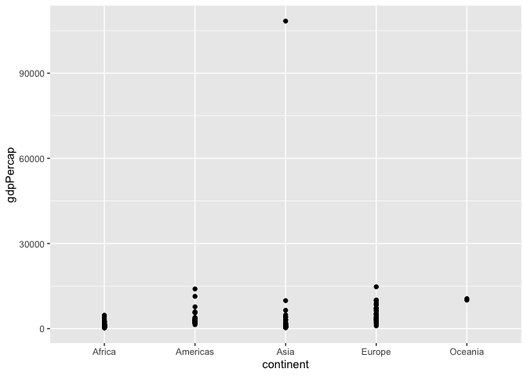

Gapminder
================
Elliott Donlon
25 July 2020

  - [Grading Rubric](#grading-rubric)
      - [Individual](#individual)
      - [Team](#team)
      - [Due Date](#due-date)
  - [Guided EDA](#guided-eda)
  - [Your Own EDA](#your-own-eda)

*Purpose*: Learning to do EDA well takes practice\! In this challenge
you’ll further practice EDA by first completing a guided exploration,
then by conducting your own investigation. This challenge will also give
you a chance to use the wide variety of visual tools we’ve been
learning.

<!-- include-rubric -->

# Grading Rubric

<!-- -------------------------------------------------- -->

Unlike exercises, **challenges will be graded**. The following rubrics
define how you will be graded, both on an individual and team basis.

## Individual

<!-- ------------------------- -->

| Category    | Unsatisfactory                                                                   | Satisfactory                                                               |
| ----------- | -------------------------------------------------------------------------------- | -------------------------------------------------------------------------- |
| Effort      | Some task **q**’s left unattempted                                               | All task **q**’s attempted                                                 |
| Observed    | Did not document observations                                                    | Documented observations based on analysis                                  |
| Supported   | Some observations not supported by analysis                                      | All observations supported by analysis (table, graph, etc.)                |
| Code Styled | Violations of the [style guide](https://style.tidyverse.org/) hinder readability | Code sufficiently close to the [style guide](https://style.tidyverse.org/) |

## Team

<!-- ------------------------- -->

| Category   | Unsatisfactory                                                                                   | Satisfactory                                       |
| ---------- | ------------------------------------------------------------------------------------------------ | -------------------------------------------------- |
| Documented | No team contributions to Wiki                                                                    | Team contributed to Wiki                           |
| Referenced | No team references in Wiki                                                                       | At least one reference in Wiki to member report(s) |
| Relevant   | References unrelated to assertion, or difficult to find related analysis based on reference text | Reference text clearly points to relevant analysis |

## Due Date

<!-- ------------------------- -->

All the deliverables stated in the rubrics above are due on the day of
the class discussion of that exercise. See the
[Syllabus](https://docs.google.com/document/d/1jJTh2DH8nVJd2eyMMoyNGroReo0BKcJrz1eONi3rPSc/edit?usp=sharing)
for more information.

``` r
library(tidyverse)
```

    ## ── Attaching packages ─────────────────────────────────────── tidyverse 1.3.0 ──

    ## ✓ ggplot2 3.3.2     ✓ purrr   0.3.4
    ## ✓ tibble  3.0.1     ✓ dplyr   1.0.0
    ## ✓ tidyr   1.1.0     ✓ stringr 1.4.0
    ## ✓ readr   1.3.1     ✓ forcats 0.5.0

    ## ── Conflicts ────────────────────────────────────────── tidyverse_conflicts() ──
    ## x dplyr::filter() masks stats::filter()
    ## x dplyr::lag()    masks stats::lag()

``` r
library(gapminder)
```

*Background*: [Gapminder](https://www.gapminder.org/about-gapminder/) is
an independent organization that seeks to education people about the
state of the world. They promote a “fact-based worldview” by focusing on
data. The dataset we’ll study in this challenge is from Gapminder.

# Guided EDA

<!-- -------------------------------------------------- -->

First, we’ll go through a round of *guided EDA*. Try to pay attention to
the high-level process we’re going through—after this guided round
you’ll be responsible for doing another cycle of EDA on your own\!

**q0** Perform your “first checks” on the dataset. What variables are in
this dataset?

``` r
## TASK: Do your "first checks" here!
glimpse(gapminder)
```

    ## Rows: 1,704
    ## Columns: 6
    ## $ country   <fct> Afghanistan, Afghanistan, Afghanistan, Afghanistan, Afghani…
    ## $ continent <fct> Asia, Asia, Asia, Asia, Asia, Asia, Asia, Asia, Asia, Asia,…
    ## $ year      <int> 1952, 1957, 1962, 1967, 1972, 1977, 1982, 1987, 1992, 1997,…
    ## $ lifeExp   <dbl> 28.801, 30.332, 31.997, 34.020, 36.088, 38.438, 39.854, 40.…
    ## $ pop       <int> 8425333, 9240934, 10267083, 11537966, 13079460, 14880372, 1…
    ## $ gdpPercap <dbl> 779.4453, 820.8530, 853.1007, 836.1971, 739.9811, 786.1134,…

``` r
summary(gapminder)
```

    ##         country        continent        year         lifeExp     
    ##  Afghanistan:  12   Africa  :624   Min.   :1952   Min.   :23.60  
    ##  Albania    :  12   Americas:300   1st Qu.:1966   1st Qu.:48.20  
    ##  Algeria    :  12   Asia    :396   Median :1980   Median :60.71  
    ##  Angola     :  12   Europe  :360   Mean   :1980   Mean   :59.47  
    ##  Argentina  :  12   Oceania : 24   3rd Qu.:1993   3rd Qu.:70.85  
    ##  Australia  :  12                  Max.   :2007   Max.   :82.60  
    ##  (Other)    :1632                                                
    ##       pop              gdpPercap       
    ##  Min.   :6.001e+04   Min.   :   241.2  
    ##  1st Qu.:2.794e+06   1st Qu.:  1202.1  
    ##  Median :7.024e+06   Median :  3531.8  
    ##  Mean   :2.960e+07   Mean   :  7215.3  
    ##  3rd Qu.:1.959e+07   3rd Qu.:  9325.5  
    ##  Max.   :1.319e+09   Max.   :113523.1  
    ## 

**Observations**:

  - country, continent, year, lifeExp, pop, gdpPercap

**q1** Determine the most and least recent years in the `gapminder`
dataset.

``` r
## TASK: Find the largest and smallest values of `year` in `gapminder`
year_max <- 
  gapminder %>% 
  select(year) %>%
  max()
year_min <-
  gapminder %>% 
  select(year) %>%
  min()

year_max
```

    ## [1] 2007

``` r
year_min
```

    ## [1] 1952

Use the following test to check your work.

``` r
## NOTE: No need to change this
assertthat::assert_that(year_max %% 7 == 5)
```

    ## [1] TRUE

``` r
assertthat::assert_that(year_max %% 3 == 0)
```

    ## [1] TRUE

``` r
assertthat::assert_that(year_min %% 7 == 6)
```

    ## [1] TRUE

``` r
assertthat::assert_that(year_min %% 3 == 2)
```

    ## [1] TRUE

``` r
print("Nice!")
```

    ## [1] "Nice!"

**q2** Filter on years matching `year_min`, and make a plot of the GDE
per capita against continent. Choose an appropriate `geom_` to visualize
the data. What observations can you make?

You may encounter difficulties in visualizing these data; if so document
your challenges and attempt to produce the most informative visual you
can.

``` r
## TASK: Create a visual of gdpPercap vs continent
gapminder %>% 
  filter(year == year_min) %>% 
  ggplot() +
  geom_point(mapping = aes(x = continent, y = gdpPercap))
```

<!-- -->

**Observations**: It’s hard to see what is going on with that one asian
country all the way up there. We can filter it out to get a better look
at the bulk.

``` r
## TASK: Create a visual of gdpPercap vs continent
gapminder %>% 
  filter(year == year_min) %>% 
  filter(gdpPercap < 30000) %>% 
  arrange(desc(gdpPercap)) %>% 
  ggplot() +
  geom_point(mapping = aes(x = continent, y = gdpPercap)) +
  theme(axis.text.x = element_text(angle = 90))
```

<!-- -->

**Observations**: We have a visual distribution of the countries binned
into their continents at the appropriate GDP levels. Can we represent
this better with a column graph?

``` r
## TASK: Create a visual of gdpPercap vs continent
gapminder %>% 
  filter(year == year_min) %>% 
  filter(gdpPercap < 30000) %>% 
  group_by(continent) %>% 
  ggplot() +
  geom_col(
    mapping = aes(
      x = continent,
      y = fct_reorder(continent, gdpPercap)
    ),
    position = 'dodge'
  )
```

<!-- -->

``` r
  #theme(axis.text.x = element_text(angle = 90))
```

**Observations**: The anser is: kind of. I tried it without the dodge
position initially and they all stacked on top of each other to form a
huge stacked mess that didn’t make any physical sense. With the dodge
position I would expect that countries would each have their own column
but that appears to not be the case (it just seems to take the max of
that continent). I also tried to arrange them but that didn’t seem to
work.

``` r
## TASK: Create a visual of gdpPercap vs continent
gapminder %>% 
  filter(year == year_min) %>% 
  filter(gdpPercap < 30000) %>% 
  #arrange(desc(gdpPercap)) %>% 
  #mutate(gdpordered = factor(gdpPercap, levels = gdpPercap)) %>%
  group_by(continent) %>% 
  ggplot() +
  geom_col(mapping = aes(x = continent, y = gdpPercap, color = country), position = 'dodge')
```

<!-- -->

``` r
  #theme(axis.text.x = element_text(angle = 90))
```

**Observations**: This was an odd error I wanted to document. There’s
just no plot here since the legend is enormous.

``` r
## TASK: Create a visual of gdpPercap vs continent
gapminder %>% 
  filter(year == year_min) %>% 
  filter(gdpPercap < 30000) %>% 
  group_by(continent) %>% 
  ggplot() +
  geom_boxplot(mapping = aes(x = continent, y = gdpPercap))
```

<!-- -->

**Observations**: This one is just a slightly more tractable version of
the geom\_point.

**Difficulties & Approaches**:

The outliers definitely make it harder to look at the bulk of the
countries but we can filter to look at them separately. The column geom
would be nice for looking at this sort of thing but I couldn’t get the
dodge to work properly and even still, there would be too many countries
on a single axis to discern them. Even if countries are mapped to a
different aesthetic, there are too many of them to see along an axis or
in a legend simultaneously.

**q3** You should have found at least three outliers in q2. Identify
those outliers (figure out which countries they are).

*Note*: I realize the reasons for…

``` r
## TASK: Identify the outliers from q2
gapminder %>% 
  filter(year == year_min) %>% 
  filter(gdpPercap > 12000) %>% 
  ggplot() +
  geom_col(mapping = aes(x = country, y = gdpPercap, fill = pop))
```

<!-- -->

**Observations**:

All three of them are highly-productive in the senses that GDP measures.
Two of them have relatively small populations and one (United States)
has a larger population, but still has a high GDP to population ratio.
It makes sense to me that Kuwait is an outlier in this way since it is a
small, oil-producing country.

**q4** Create a plot similar to yours from q2 studying both `year_min`
and `year_max`. Find a way to highlight the outliers from q3 on your
plot. Compare the patterns between `year_min` and `year_max`.

*Hint*: We’ve learned a lot of different ways to show multiple
variables; think about using different aesthetics or facets.

``` r
## TASK: Create a visual of gdpPercap vs continent
year_min_outliers <- gapminder %>% 
  filter(
    year == year_min | year == year_max
  ) %>% 
  filter(
    country == "Kuwait" | country == "Switzerland" | country == "United States"
  )
gapminder %>% 
  filter(
    year == year_min | year == year_max
  ) %>% 
  group_by(continent) %>% 
  ggplot() +
  geom_boxplot(mapping = aes(x = continent, y = gdpPercap)) +
  facet_grid( ~ year) +
year_min_outliers %>% 
  geom_point(
    mapping = aes(x = continent, y = gdpPercap, color = country)
  ) +
  theme(axis.text.x = element_text(angle = 90))
```

<!-- -->

**Observations**:

From the begining to the end of the dataset, Kuwait went from beign far
outside of the pack to barely being an outlier. Switzerland has also
decreased its “lead” relative to other European countries. The United
States, however, appears to at least be the same amount of outlier that
it was before relative to the Americas but it is hard to say without
doing a % difference from the median American country since countries
are on average richer now.

# Your Own EDA

<!-- -------------------------------------------------- -->

Now it’s your turn\! We just went through guided EDA considering the GDP
per capita at two time points. You can continue looking at outliers,
consider different years, repeat the exercise with `lifeExp`, consider
the relationship between variables, or something else entirely.

**q5** Create *at least* three new figures below. With each figure, try
to pose new questions about the data.

``` r
## TASK: Your first graph
#Hans Rosling style, let's start with looking at life expectancy and GDP per capita (first, for a single year)
gapminder %>% 
  filter(year == year_min) %>% 
  ggplot() +
  geom_point(mapping = aes(x = gdpPercap, y = lifeExp))
```

<!-- -->

**Observations** That darn Kuwait is pulling our axes away again. Let’s
explicitly remove it for now.

``` r
## TASK: Your first graph
#Hans Rosling style, let's start with looking at life expectancy and GDP per capita (first, for a single year)
gapminder %>% 
  filter(year == year_min) %>% 
  filter(country != "Kuwait") %>% 
  ggplot() +
  geom_point(
    mapping = aes(
      x = gdpPercap, 
      y = lifeExp, 
      color = continent, 
      size = pop
    )
  ) +
  labs(
    title= "Population normalized GDP vs. Life Expectancy",
    y= "Life Expectancy (years)",
    x = "GDP per capita (PPP$ inflation-adjusted)",
    color = "Continent",
    size = "Population (People)"
  )
```

<!-- -->

**Observations** Looks like in 1957, our African and Asian countries
are, in general, lower-GDP and lower life expectancy than the other
continents. European countries are generally higher life expectancy but
span the whole range of GDPs.

``` r
## TASK: Your second graph
# It would be interesting to see progress over time
gapminder %>% 
  filter(country != "Kuwait") %>% 
  ggplot() +
  geom_point(
    mapping = aes(
      x = gdpPercap, 
      y = lifeExp, 
      color = year, 
      shape = continent
    )
  ) +
  labs(
    title= "Population normalized GDP vs. Life Expectancy",
    y= "Life Expectancy (years)",
    x = "GDP per capita (PPP$ inflation-adjusted log10)",
    color = "Year",
    shape = "Continent"
  ) +
  scale_x_log10()
```

<!-- -->

**Observations** Looks like over time, countries have, in general,
gotten richer and longer-living. Again, we see that the African
continent consistently has the lowest life expectancy.

``` r
## TASK: Your third graph
#Let's back up that last observation with a clearer visual
gapminder %>% 
  filter(str_detect(year, "7")) %>% 
  group_by(continent) %>% 
  ggplot() +
  geom_boxplot(
    mapping = aes(
      x = gdpPercap,
      y = lifeExp, 
      color = continent, 
    )
  ) +
  facet_grid( ~ year) +
  labs(
    title= "Population normalized GDP vs. Life Expectancy",
    y= "Life Expectancy (years)",
    x = "GDP per capita (PPP$ inflation-adjusted log10)",
    color = "Continent"
  ) +
  scale_x_log10() +
  theme(axis.text.x = element_text(angle = 90))
```

<!-- -->

**Observations** As we can see more clearly now, Africa is consistently
on the bottom of life expectancy while Europe is almost completely
non-overlapping with it. Notably, we see an interesting trend of Asia
starting off with a median much closer to Africa’s while in the final
year, its median is much closer to Europe and the Americas. However,
there are still a few outliers in Asia that are the worst or nearly the
worst in the dataset.
