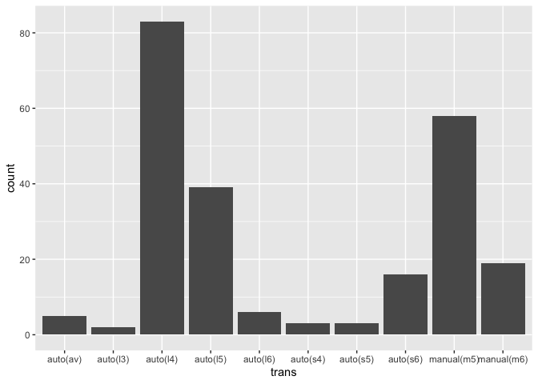
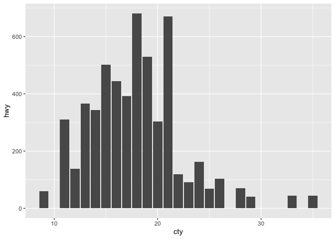
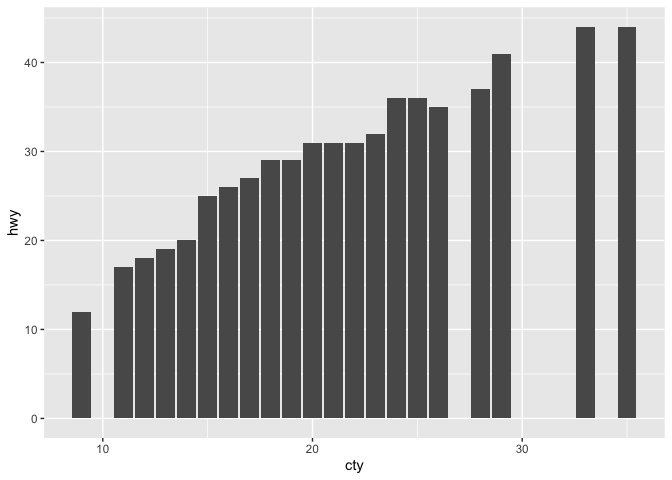
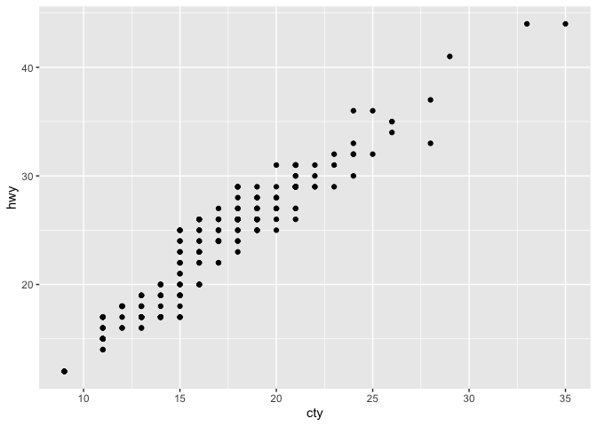
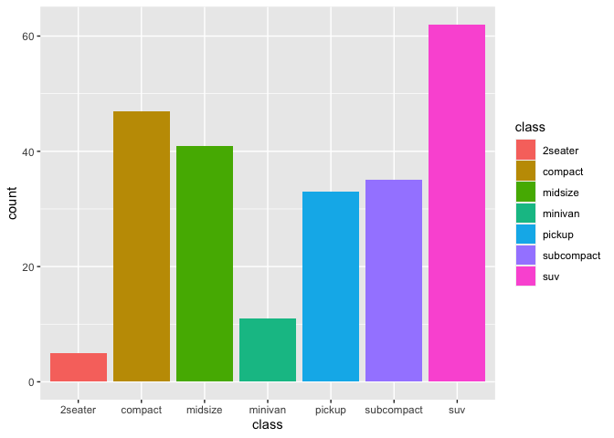
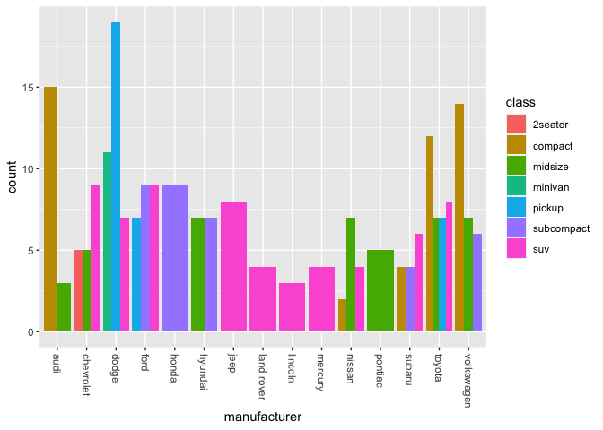
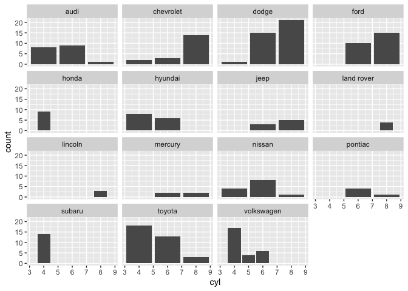

Visualization: Bar Charts
================
Zach del Rosario
2020-05-13

*Purpose*: *Bar charts* are a key tool for EDA. In this exercise, we’ll
learn how to construct a variety of different bar charts, as well as
when—and when *not*—to use various charts.

*Reading*: [Bar Charts](https://rstudio.cloud/learn/primers/3.2)
*Topics*: (All topics) *Reading Time*: \~30 minutes

``` r
library(tidyverse)
```

    ## ── Attaching packages ───────────────────────────────────────────────── tidyverse 1.3.0 ──

    ## ✓ ggplot2 3.3.2     ✓ purrr   0.3.4
    ## ✓ tibble  3.0.1     ✓ dplyr   1.0.0
    ## ✓ tidyr   1.1.0     ✓ stringr 1.4.0
    ## ✓ readr   1.3.1     ✓ forcats 0.5.0

    ## ── Conflicts ──────────────────────────────────────────────────── tidyverse_conflicts() ──
    ## x dplyr::filter() masks stats::filter()
    ## x dplyr::lag()    masks stats::lag()

**q1** In the reading, you learned the relation between `geom_bar()` and
`geom_col()`. Use that knowledge to convert the following `geom_bar()`
plot into the same visual using `geom_col()`.

``` r
#original code
mpg %>%
  ggplot(aes(trans)) +
  geom_bar()
```

<!-- -->

``` r
#altered code
mpg %>%
  count(trans) %>%
  ggplot() +
  geom_col(mapping = aes(x = trans, y = n))
```

<!-- -->

The reading mentioned that when using `geom_col()` our x-y data should
be `1-to-1`. This next exercise will probe what happens when our data
are not `1-to-1`, and yet we use a `geom_col()`. Note that a
[one-to-one](https://en.wikipedia.org/wiki/Injective_function) function
is one where each input leads to a single output. For the `mpg` dataset,
we can see that the pairs `cty, hwy` clearly don’t have this one-to-one
property:

``` r
## NOTE: Run this chunk for an illustration
mpg %>% filter(cty == 20)
```

    ## # A tibble: 11 x 11
    ##    manufacturer model    displ  year   cyl trans  drv     cty   hwy fl    class 
    ##    <chr>        <chr>    <dbl> <int> <int> <chr>  <chr> <int> <int> <chr> <chr> 
    ##  1 audi         a4         2    2008     4 manua… f        20    31 p     compa…
    ##  2 audi         a4 quat…   2    2008     4 manua… 4        20    28 p     compa…
    ##  3 hyundai      tiburon    2    2008     4 manua… f        20    28 r     subco…
    ##  4 hyundai      tiburon    2    2008     4 auto(… f        20    27 r     subco…
    ##  5 subaru       foreste…   2.5  2008     4 manua… 4        20    27 r     suv   
    ##  6 subaru       foreste…   2.5  2008     4 auto(… 4        20    26 r     suv   
    ##  7 subaru       impreza…   2.5  2008     4 auto(… 4        20    25 p     compa…
    ##  8 subaru       impreza…   2.5  2008     4 auto(… 4        20    27 r     compa…
    ##  9 subaru       impreza…   2.5  2008     4 manua… 4        20    27 r     compa…
    ## 10 volkswagen   new bee…   2.5  2008     5 manua… f        20    28 r     subco…
    ## 11 volkswagen   new bee…   2.5  2008     5 auto(… f        20    29 r     subco…

**q2** The following code attempts to visualize `cty, hwy` from `mpg`
using `geom_col()`. There’s something fishy about the `hwy` values;
what’s wrong here?

*Hint*: Try changing the `position` parameter for `geom_col()`.

``` r
#original
mpg %>%
  ggplot(aes(x = cty, y = hwy)) +
  geom_col()
```

<!-- -->

``` r
#modified
mpg %>%
  ggplot(aes(x = cty, y = hwy)) +
  geom_col(position = 'dodge')
```

<!-- -->

**Observations**: - with the bars stacked on top of each other, the hwy
gas mileage of the most prevalent cars looks way too high. When we split
them with ‘dodge’ then we get to see what is actually going on at each
fuel mileage.

A more standard way to visualize this kind of data is a *scatterplot*,
which we’ll study later. For now, here’s an example of a more effective
way to visualize `cty` vs `hwy`:

``` r
## NOTE: Run this chunk for an illustration
mpg %>%
  ggplot(aes(cty, hwy)) +
  geom_point()
```

<!-- -->

**q3** The following are two different visualizations of the `mpg`
dataset. Document your observations between the `v1` and `v2` visuals.
Then, determine which—`v1` or `v2`—enabled you to make more
observations. What was the difference between the two visuals?

``` r
## TODO: Run this code without changing, describe your observations on the data
mpg %>%
  ggplot(aes(class, fill = class)) +
  geom_bar()
```

<!-- -->

**Observations**: - SUVs are most prevalent - 2-seaters are least
prevalent and are salmon-colored

``` r
## TODO: Run this code without changing, describe your observations on the data
mpg %>%
  ggplot(aes(class, fill = drv)) +
  geom_bar()
```

<!-- -->

**Observations**: - Not only are SUVs most common but they are mostly
4wd - All pickup trucks are 4wd - All minivans are fwd - All 2 seaters
are rwd.

**Compare `v1` and `v2`**:

  - Which visualization—`v1` or `v2`—enabled you to make more
    observations?
  - What was the difference between `v1` and `v2`?
  - There was an additional dimension of data plotted on v2 relative to
    v1. They’re both pretty, but v2 is more informative.

**q4** The following code has a bug; it does not do what its author
intended. Identify and fix the bug. What does the resulting graph tell
you about the relation between `manufacturer` and `class` of cars in
this dataset?

*Note*: I use a `theme()` call to rotate the x-axis labels. We’ll learn
how to do this in a future exercise.

``` r
#original
mpg %>%
  ggplot(aes(x = manufacturer, fill = class), position = "dodge") +
  geom_bar() +
  theme(axis.text.x = element_text(angle = 270, vjust = 0.5, hjust = 0))
```

<!-- -->

``` r
#modified
mpg %>%
  ggplot(aes(x = manufacturer, fill = class)) +
  geom_bar(position = 'dodge') +
  theme(axis.text.x = element_text(angle = 270, vjust = 0.5, hjust = 0))
```

<!-- -->

**Observations** - Not only is “Dodge” an unfortunate name collision,
but it was in the ggplot call instead of the geom\_bar call. - This does
not actually set the position correct and doesn’t seem to throw an error
either.

**q5** The following graph is hard to read. What other form of faceting
would make the visual more convenient to read? Modify the code below
with your suggested improvement.

``` r
mpg %>%
  ggplot(aes(x = cyl)) +
  geom_bar() +
  facet_wrap(~ manufacturer)
```

<!-- -->
facet\_wrap <!-- include-exit-ticket --> \# Exit Ticket
<!-- -------------------------------------------------- -->

Once you have completed this exercise, make sure to fill out the **exit
ticket survey**, [linked
here](https://docs.google.com/forms/d/e/1FAIpQLSeuq2LFIwWcm05e8-JU84A3irdEL7JkXhMq5Xtoalib36LFHw/viewform?usp=pp_url&entry.693978880=e-vis01-bar-charts-assignment.Rmd).
