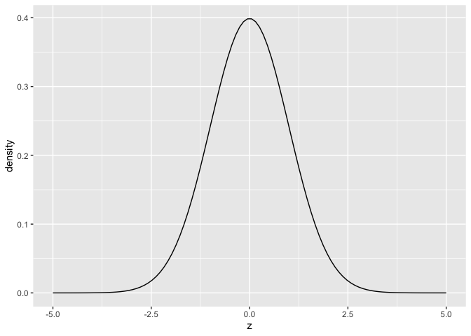
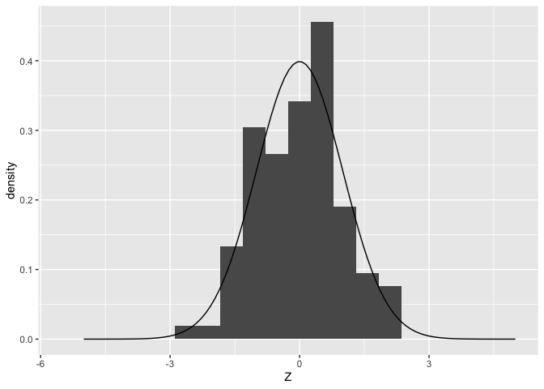
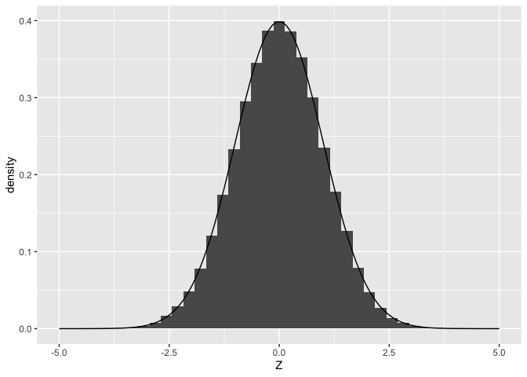
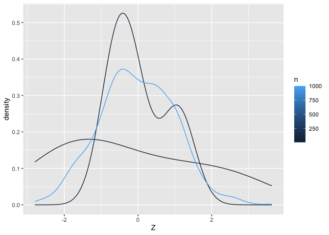

Statistics: Intro to Distributions
================
Zach del Rosario
2020-05-22

*Purpose*: We will use *distributions* to model and understand data. To
that end, we’ll need to understand some key ideas about distributions.
Namely, we’ll discuss *random variables*, how we model random variables
with distributions, and the importance of *random seeds*. We’re not
going to learn everything we need to work with data in this single
exercise, but this will be our starting point.

*Reading*: (None; this exercise *is* the reading.)

``` r
library(tidyverse)
```

    ## ── Attaching packages ───────────────────────────────────────────────── tidyverse 1.3.0 ──

    ## ✓ ggplot2 3.3.2     ✓ purrr   0.3.4
    ## ✓ tibble  3.0.1     ✓ dplyr   1.0.0
    ## ✓ tidyr   1.1.0     ✓ stringr 1.4.0
    ## ✓ readr   1.3.1     ✓ forcats 0.5.0

    ## ── Conflicts ──────────────────────────────────────────────────── tidyverse_conflicts() ──
    ## x dplyr::filter() masks stats::filter()
    ## x dplyr::lag()    masks stats::lag()

## Distributions

<!-- -------------------------------------------------- -->

Fundamentally, a distribution (also known as a density) is a *function*:
It takes an input, and returns an output. A distribution has a special
interpretation though; it represents the *relative likelihood* of
particular values occuring.

First, let’s look at a distribution of some real data:

``` r
mpg %>%
  filter(class == "midsize") %>%
  ggplot(aes(cty, color = class)) +
  geom_density()
```

<!-- -->

This density indicates that a value around `18` is more prevalent than
other values of `cty`, at least for `midsize` vehicles in this dataset.
Note that the plot above took a set of `cty` values, and smoothed them
to create a density.

Next, let’s look at a normal distribution:

``` r
## NOTE: No need to change this!
df_norm_dist <-
  tibble(z = seq(-5, +5, length.out = 100)) %>%
  mutate(d = dnorm(z, mean = 0, sd = 1))

df_norm_dist %>%
  ggplot(aes(z, d)) +
  geom_line() +
  labs(
    y = "density"
  )
```

<!-- -->

This plot of the *density* of a normal distribution shows that the value
`z = 0` is most likely, while values both larger and smaller are less
likely to occur. Note that the the density above was generated by
`dnorm(z, mean = 0, sd = 1)`. The values `[mean, sd]` are called
*parameters*. Rather than requiring an entire dataset to define this
distribution, the normal is fully defined by specifying values for
`mean` and `sd`.

However, note that the normal distribution is quite a bit simpler than
the distribution of `cty` values above. This is a general trend; named
distributions like the normal are simplified models we use to represent
real data. Picking an appropriate model is part of the challenge in
statistics.

`R` comes with a great many distributions implemented:

| Distribution | Code    |
| ------------ | ------- |
| Normal       | `norm`  |
| Uniform      | `unif`  |
| Chi-squared  | `chisq` |
| …            | …       |

In `R` we access a distribution by prefixing its name with the letter
`d`.

**q1** Modify the code below to evaluate a uniform distribution with
`min = -1` and `max = +1`. Assign this value to `d`.

``` r
## TODO: Complete this code
df_q1 <-
  tibble(x = seq(-5, +5, length.out = 100)) %>%
  mutate(d = dunif(x, min = -1, max = 1))
df_q1
```

    ## # A tibble: 100 x 2
    ##        x     d
    ##    <dbl> <dbl>
    ##  1 -5        0
    ##  2 -4.90     0
    ##  3 -4.80     0
    ##  4 -4.70     0
    ##  5 -4.60     0
    ##  6 -4.49     0
    ##  7 -4.39     0
    ##  8 -4.29     0
    ##  9 -4.19     0
    ## 10 -4.09     0
    ## # … with 90 more rows

Use the following test to check your answer.

``` r
## NOTE: No need to change this
assertthat::assert_that(
  all(
    df_q1 %>%
      filter(-1 <= x, x <= +1) %>%
      mutate(flag = d > 0) %>%
      pull(flag)
    )
)
```

    ## [1] TRUE

``` r
assertthat::assert_that(
  all(
    df_q1 %>%
      filter((x < -1) | (+1 < x)) %>%
      mutate(flag = d == 0) %>%
      pull(flag)
    )
)
```

    ## [1] TRUE

``` r
print("Nice!")
```

    ## [1] "Nice!"

## Drawing Samples: A Model for Randomness

<!-- -------------------------------------------------- -->

What does it *practically* mean for a value to be more or less likely? A
distribution gives information about a *random variable*. A random
variable is a quantity that takes a random value every time we observe
it. For instance: If we roll a six-sided die, it will (unpredictably)
land on values `1` through `6`. In my research, I use random variables
to model material properties: Every component that comes off an assembly
line will have a different strength associated with it. In order to
design for a desired rate of failure, I model this variability with a
random variable. A single value from a random variable—a roll of the die
or a single value of material strength—is called a *realization*.

Let’s illustrate this idea by using a normal distribution to define a
*random variable* `Z`. This is sometimes denoted `Z ~ norm(mean, sd)`,
which means `Z` is distributed as a normal distribution with `mean` and
`sd`. The code below illustrates what it looks like when we draw a few
samples of `Z`.

``` r
## NOTE: No need to change this!
df_norm_samp <- tibble(Z = rnorm(n = 100, mean = 0, sd = 1))

ggplot() +
  ## Plot a *sample*
  geom_histogram(
    data = df_norm_samp,
    mapping = aes(Z, after_stat(density)),
    bins = 20
  ) +
  ## Plot a *distribution*
  geom_line(
    data = df_norm_dist,
    mapping = aes(z, d)
  )
```

<!-- -->

Note that the histogram of `Z` values looks like a “blocky” version of
the density. If we draw many more samples, the histogram will start to
strongly resemble the distribution from which it was drawn:

``` r
## NOTE: No need to change this!
ggplot() +
  ## Plot a *sample*
  geom_histogram(
    data = tibble(Z = rnorm(n = 1e5, mean = 0, sd = 1)),
    mapping = aes(Z, after_stat(density)),
    bins = 40
  ) +
  ## Plot a *distribution*
  geom_line(
    data = df_norm_dist,
    mapping = aes(z, d)
  )
```

<!-- -->

To clarify some terms:

  - A **realization** is a single observed value of a random variable. A
    realization is a single value, e.g. `rnorm(n = 1)`.
  - A **sample** is a set of realizations. A sample is a set of values,
    e.g. `rnorm(n = 10)`.
  - A **distribution** is a function that describes the relative
    frequency of all the values a random variable might take. A
    distribution is a function, e.g. `dnorm(x)`.

**q2** Plot densities for `Z` values in `df_q2`. Use aesthetics to plot
a separate curve for different values of `n`. Comment on which values of
`n` give a density closer to “normal”.

*Hint*: You may need to use the `group` aesthetic, in addition to
`color` or `fill`.

``` r
## NOTE: Use the data generated here
df_q2 <- map_dfr(
  c(5, 10, 1e3),
  function(nsamp) {
    tibble(Z = rnorm(n = nsamp), n = nsamp)
  }
)
## TODO: Create the figure
df_q2 %>% 
  ggplot() +
    geom_density(
      mapping = aes(x = Z, color = n, group = n)
    )
```

<!-- -->

**Observations** - The largest values of n seem to look the most
“normal”.

## Random Seeds: Setting the State

<!-- -------------------------------------------------- -->

Remember that random variables are *random*. That means if we draw
samples multiple times, we’re bound to get different values. For
example, run the following code chunk multiple times.

``` r
## NOTE: No need to change; run this multiple times!
rnorm(5)
```

    ## [1]  0.55619450 -0.16804952 -0.36797300  0.78530379 -0.09766288

What this means is we’ll get a slightly different picture every time we
draw a sample. **This is the challenge with randomness**: Since we could
have drawn a different set of samples, we need to know the degree to
which we can trust conclusions drawn from data. Being *statistically
literate* means knowing how much to trust your data.

``` r
## NOTE: No need to change this!
df_samp_multi <-
  tibble(Z = rnorm(n = 50, mean = 0, sd = 1), Run = "A") %>%
  bind_rows(
    tibble(Z = rnorm(n = 50, mean = 0, sd = 1), Run = "B")
  ) %>%
  bind_rows(
    tibble(Z = rnorm(n = 50, mean = 0, sd = 1), Run = "C")
  )

ggplot() +
  ## Plot *fitted distributions*
  geom_density(
    data = df_samp_multi,
    mapping = aes(Z, color = Run, group = Run)
  ) +
  ## Plot a *distribution*
  geom_line(
    data = df_norm_dist,
    mapping = aes(z, d)
  )
```

<!-- -->

*However* for simulation purposes, we often want to be able to repeat a
calculation. In order to do this, we can set the *state* of our random
number generator by setting the *seed*. To illustrate, try running the
following chunk multiple times.

``` r
## NOTE: No need to change; run this multiple times!
set.seed(101)
rnorm(5)
```

    ## [1] -0.3260365  0.5524619 -0.6749438  0.2143595  0.3107692

The values are identical every time\!

<!-- include-exit-ticket -->

# Exit Ticket

<!-- -------------------------------------------------- -->

Once you have completed this exercise, make sure to fill out the **exit
ticket survey**, [linked
here](https://docs.google.com/forms/d/e/1FAIpQLSeuq2LFIwWcm05e8-JU84A3irdEL7JkXhMq5Xtoalib36LFHw/viewform?usp=pp_url&entry.693978880=e-stat01-distributions-assignment.Rmd).
